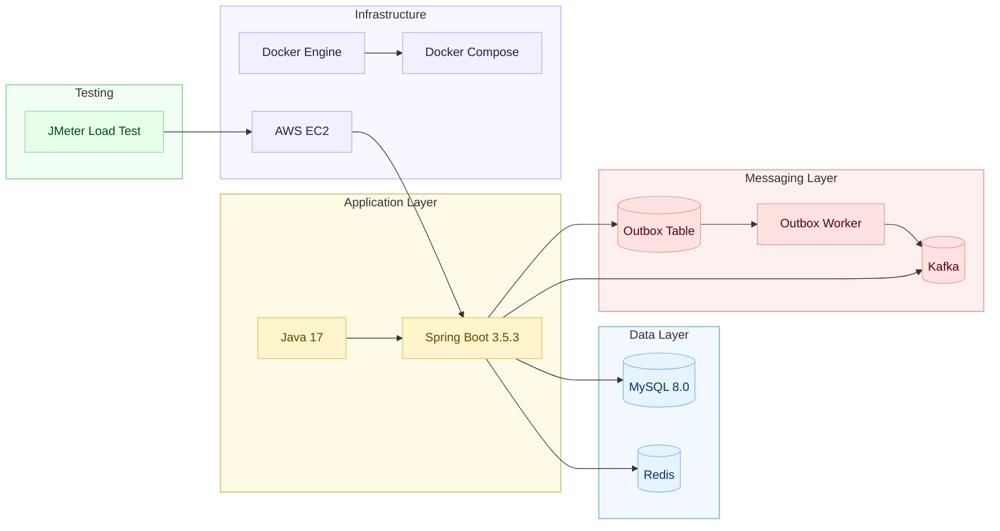

# 🤍 이벤트 커머스 시스템 

실무에서 경험하기 어려운 고트래픽 결제·커머스 구조를 직접 설계하고 검증하기 위해 진행한 사이드 프로젝트입니다.
**선착순 쿠폰 발급 → 이벤트 시작 → 재고 한정 특가 구매 →  결제**까지 이어지는 이벤트형 커머스 플로우를 구현했습니다.

## 프로젝트 목표
- 순간 트래픽을 안정적으로 처리할 수 있는 커머스 시스템 구축
- 선착순/재고 경쟁 상황의 대규모 동시성 이슈 해결  

## 주요 구현 및 해결 과제
- Redis Lua Script 기반 재고 동시성 제어
  - 재고 차감을 여러 명령어로 처리할 경우 Race Condition 발생 가능 → Lua Script로 원자적 실행 보장
  - 재고 예약(hold) TTL 만료처리로 미확정 재고 자동 반환 및 정합성 유지 
- Transactional Outbox 패턴 + Kafka 기반 비동기 처리 구조
  - 주문/결제 요청의 비동기 처리 아키텍처 설계
  - Kafka 발행 전 서버 장애 시 메시지 유실 가능 → DB 트랜잭션과 메시지 발행을 원자적으로 묶어 유실 방지
  - 지수 backoff 기반 재시도로 이벤트 전달 안정성 확보
- DLT 기반 보상 트랜잭션
  - 쿠폰 발급 최종 실패 시 Redis 재고가 차감된 채로 남는 문제 → DLT로 실패 이벤트 감지 후 자동 롤백 처리
- Redis Key Expiration Listener + 스케줄러 기반 이벤트 관리
  - 이벤트 자동 오픈 처리 
  - 리스너 미수신, 재시작 등 예외 상황에 대비한 스케줄러 기반 복구 처리
- SSE 기반 이벤트 실시간 알림
  - 이벤트 오픈 시 Redis Key Expiration → Kafka → SSE로 이어지는 
    실시간 알림 파이프라인 구현
  - 단방향 스트리밍으로 WebSocket 대비 서버 리소스 절감

  
## 사용 기술
- **Language**: Java 17
- **Framework**: Spring Boot 3.5.3
- **Database**: MySQL 8.0
- **Cache**: Redis
- **Messaging & Async Processing Queue**: Kafka + Outbox Pattern
- **Infra**: Docker / Docker Compose, AWS EC2
- **Load Test**: JMeter

## 시스템 아키텍처

### 🔍 Architecture 상세 문서 → [Architecture 문서](docs/architecture.md)

### 📈 전체 Sequence Diagram
- [쿠폰 발급](docs/sequence/coupon.md)
- [주문 생성](docs/sequence/order.md)
- [결제 승인](docs/sequence/payment.md)
- [이벤트 시작](docs/sequence/event.md)

## 부하테스트

### 테스트 환경
- 시나리오: 선착순 쿠폰 발급 API (Redis Lua Script + Kafka 비동기 처리)
- 도구: JMeter

### 튜닝 과정
> 병목 원인: CPU 크레딧 소진(t2.medium 버스터블 인스턴스) 및 
> 단일 서버 내 API/Redis/Kafka 리소스 경합

| 단계 | 주요 조치 | TPS | 서버 오류율 |
|------|----------|-----|------------|
| 초기 | 단일 서버 (t2.medium), 기본 설정 | ~200 | - |
| 최종 | t2.medium → c5.large 전환, API/Redis/Kafka 서버 분리, HikariCP·Tomcat·Kafka 설정 최적화 | 2,000+ | 0% |

### 인스턴스 변경 이유
t2.medium은 버스터블 인스턴스로, 지속 부하 시 CPU 크레딧 소진으로 스로틀링이 발생해 부하테스트 환경에 적합하지 않았습니다.
고정 컴퓨팅 성능을 제공하는 c5.large로 전환해 일관된 성능을 확보했습니다.

### 결과
- 목표 TPS 2,000 달성, 평균 응답시간 95~100ms
- 서버 오류율 0% 달성 : 재고 소진(410) / 중복 요청(409)은 Redis Lua Script 정상 비즈니스 응답 처리
